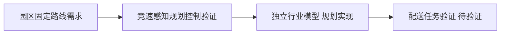
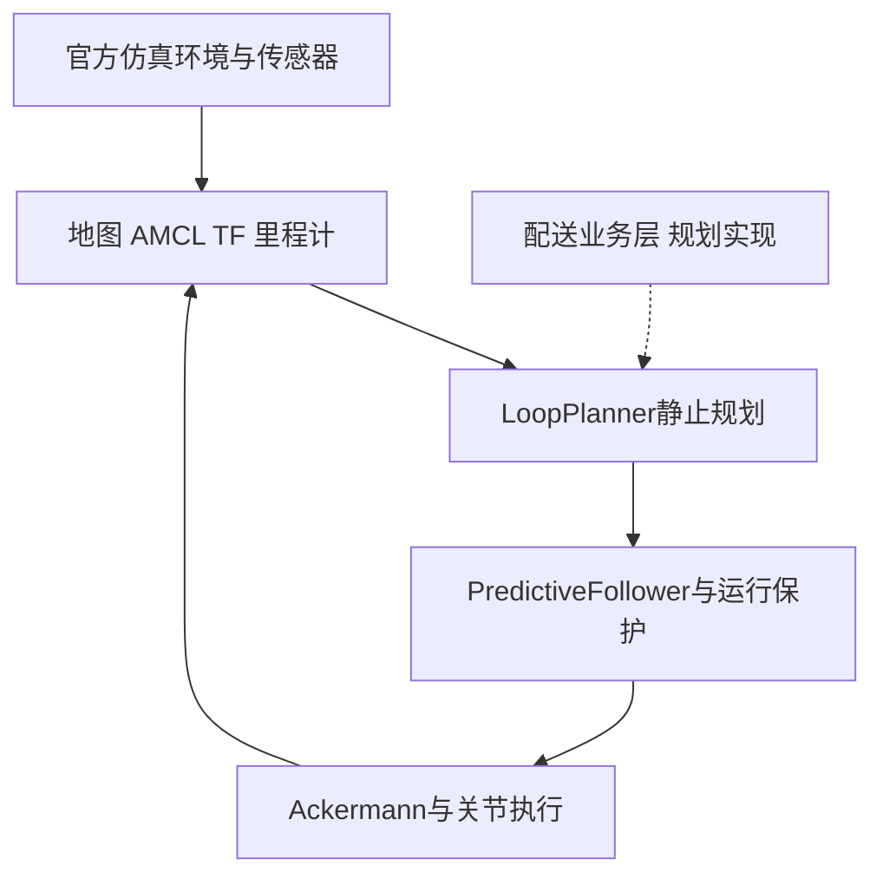
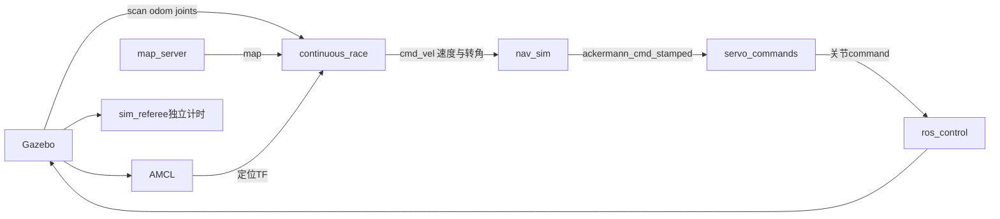
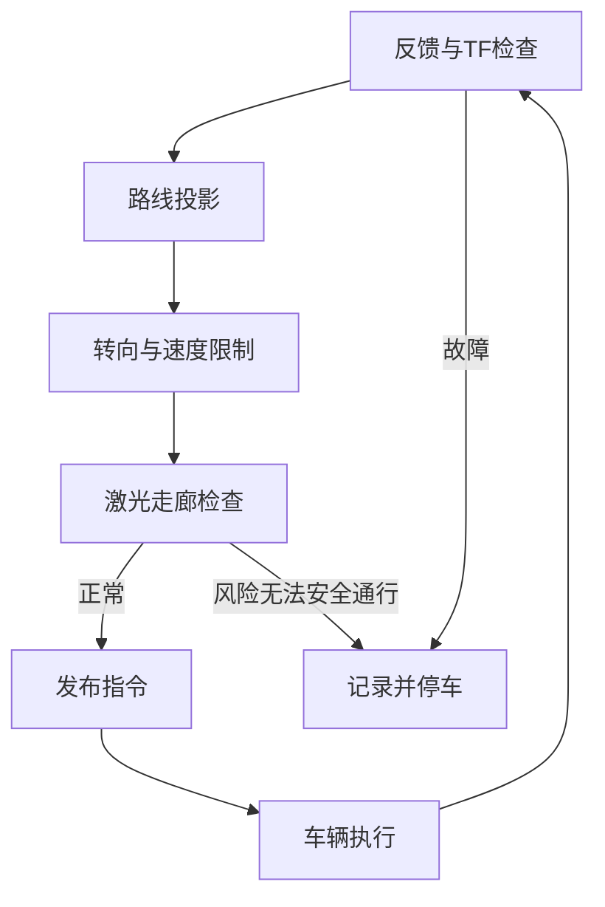
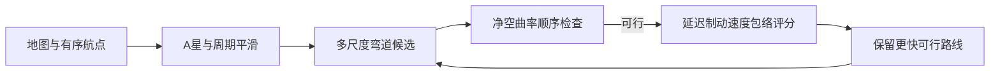
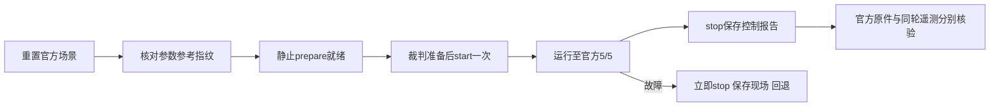

# 六幅图 Mermaid源

## 图1

```mermaid
flowchart LR
 A[园区固定路线需求] --> B[竞速感知规划控制验证] --> C[独立行业模型 规划实现] --> D[配送任务验证 待验证]
```

## 图2

```mermaid
flowchart TB
 E[官方仿真环境与传感器] --> L[地图 AMCL TF 里程计] --> P[LoopPlanner静止规划] --> C[PredictiveFollower与运行保护] --> X[Ackermann与关节执行]
 X --> L
 B[配送业务层 规划实现] -.-> P
```

## 图3

```mermaid
flowchart LR
 G[Gazebo] -->|scan odom joints| C[continuous_race]
 M[map_server] -->|map| C
 A[AMCL] -->|定位TF| C
 G --> A
 C -->|cmd_vel 速度与转角| N[nav_sim] -->|ackermann_cmd_stamped| S[servo_commands] -->|关节command| X[ros_control]
 X --> G
 G --> R[sim_referee独立计时]
```

## 图4

```mermaid
flowchart TD
 A[反馈与TF检查] --> B[路线投影] --> C[转向与速度限制] --> D[激光走廊检查]
 D -->|正常| E[发布指令] --> F[车辆执行] --> A
 A -->|故障| S[记录并停车]
 D -->|风险无法安全通行| S
```

## 图5

```mermaid
flowchart LR
 A[地图与有序航点] --> B[A星与周期平滑] --> C[多尺度弯道候选] --> D[净空曲率顺序检查]
 D -->|可行| E[延迟制动速度包络评分] --> F[保留更快可行路线]
 F --> C
```

## 图6

```mermaid
flowchart LR
 A[重置官方场景] --> B[核对参数参考指纹] --> C[静止prepare就绪] --> D[裁判准备后start一次] --> E[运行至官方5/5]
 E --> F[stop保存控制报告] --> G[官方原件与同轮遥测分别核验]
 E -->|故障| H[立即stop 保存现场 回退]
```
